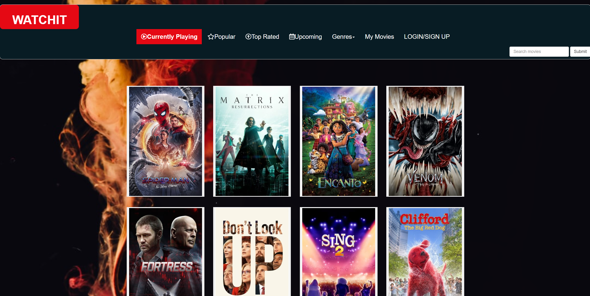
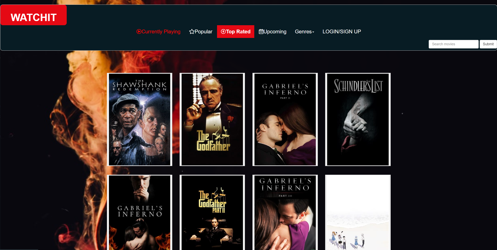
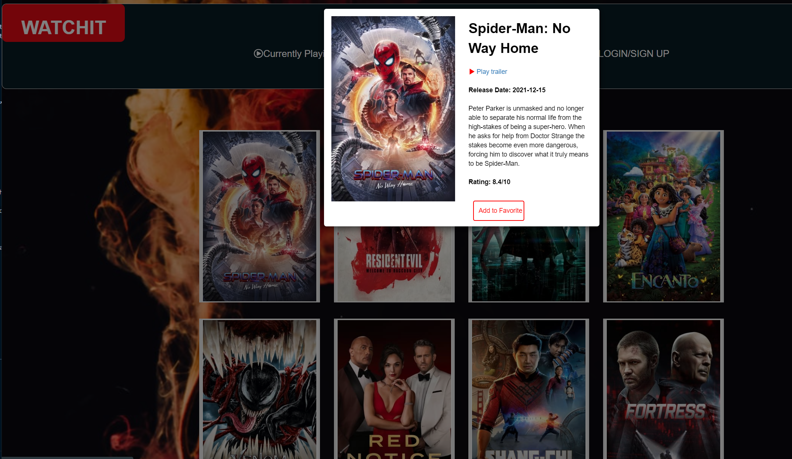
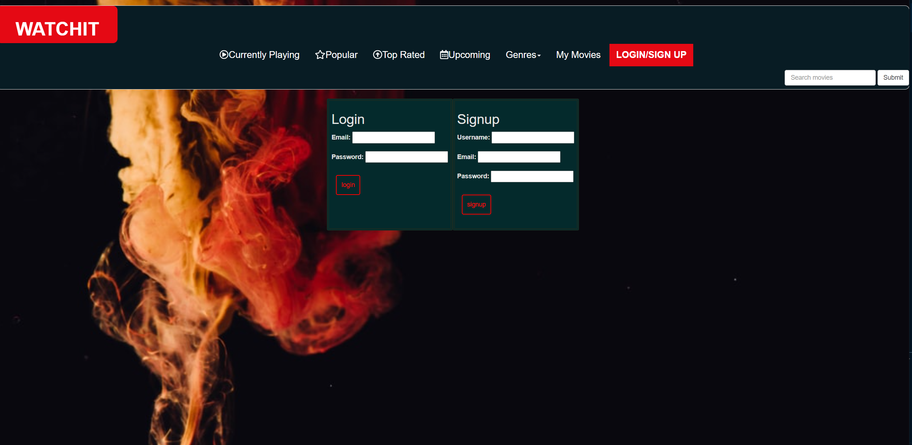
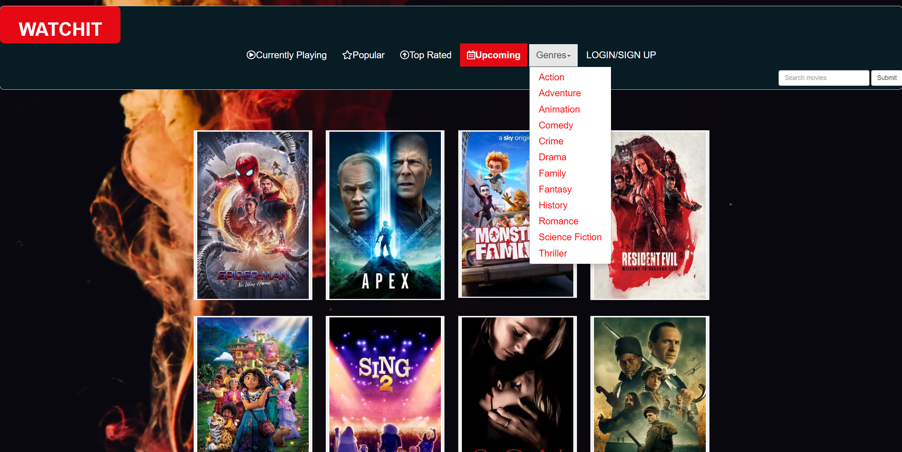
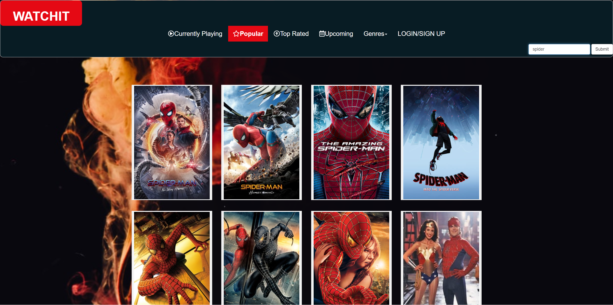

# Watch-iT

Watch-iT application is a movie app . It pulls movies from The Movie Database using API calls. Users have the option to view the Now Playing, Upcoming, Tob Rated and Popular movies, sort them by genre or search for other movies using the search function. Then get back information about the movies you want and watch trailer . Maybe add a movie to your favorite list.

## Key Technologies used

- JavaScript
- jQuery
- CSS
- Node
- Express
- mySQL
- Sequelize
- MVC
- API
- Heroku
- Git
- GitHub

## User Stories

The user will first be brought to the home page where they will see some nowplaying movies displayed and the nav.

- A user can browse, search and sort movies then watch trailers not logged in.

- A user can sign up for an account or log into an existing account.

- A signed in user can add a movie to a their favorites list

## Installation & Usage

Visit the [live site on Heroku](https://watch-it-app.herokuapp.com/) for a working demo, else use "npm i" then "node server.js" to run the app from the root directory, then nav to `localhost:3001` in your browser.

## Shout outs

- Big thanks to The Movie database[TMDB](https://www.themoviedb.org/) for some inspiration and their [ API](https://developers.themoviedb.org/3/getting-started/introduction). So much you can get and the documentation is great.
- [CSS Tricks](https://css-tricks.com/)
